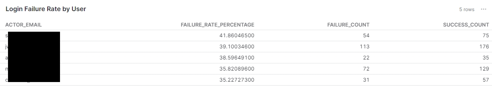

# Example queries for google workspace events

### User login failure rates.
```sql
with logins as 

(select * 
from mart_identity_event

where CONNECTOR_TYPE = 'google-workspace-events'),


login_failures as
(select count(*) as failure_count, actor_email from logins
where result = 'login_success'
group by actor_email
),

login_successes as 
(select count(*) as success_count, actor_email from logins
where result != 'login_failure'
group by actor_email
)

SELECT lf.actor_email,       
       CASE
           WHEN (lf.failure_count + ls.success_count) > 0 THEN
               (CAST(lf.failure_count AS DECIMAL(10, 2)) / (lf.failure_count + ls.success_count)) * 100
           ELSE 0
       END AS failure_rate_percentage,
    lf.failure_count,
    ls.success_count
FROM login_failures lf
LEFT JOIN login_successes ls
ON lf.actor_email = ls.actor_email
ORDER BY failure_rate_percentage desc
limit 5
```


## Tracking 2FA enrollment
```sql
with gw as
(select * 
from mart_identity_event

where CONNECTOR_TYPE = 'google-workspace-events')

select actor_email, client_ip_address  from gw
where result = '2sv_enroll'
group by actor_email, client_ip_address
```

