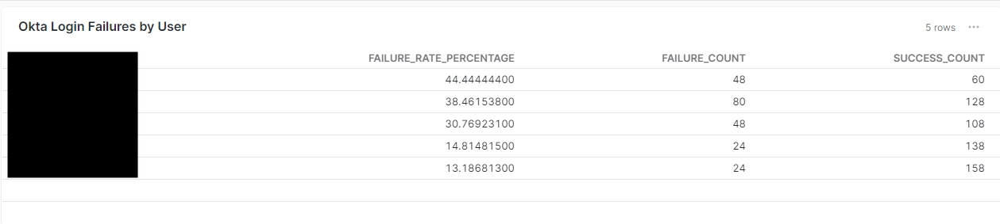
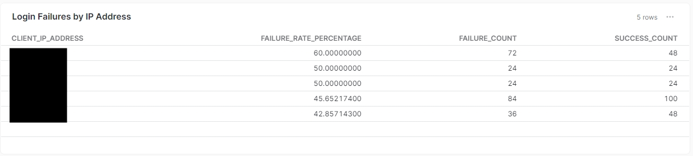
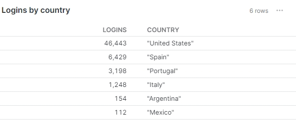

# Example Queries for Okta Identity Events


### Query your okta event logs to find users with high login failure rates.

```sql
with logins as 

(select * from mart_identity_event

where CONNECTOR_TYPE = 'okta'
and MESSAGE = 'User login to Okta'),

login_failures as
(select count(*) as failure_count, actor_name from logins
where result = 'FAILURE'
group by actor_name
),

login_successes as 
(select count(*) as success_count, actor_name from logins
where result != 'FAILURE'
group by actor_name
)

-- create our failure rate
SELECT lf.actor_name,       
       CASE
           WHEN (lf.failure_count + ls.success_count) > 0 THEN
               (CAST(lf.failure_count AS DECIMAL(10, 2)) / (lf.failure_count + ls.success_count)) * 100
           ELSE 0
       END AS failure_rate_percentage,
    lf.failure_count,
    ls.success_count
FROM login_failures lf
LEFT JOIN login_successes ls
ON lf.actor_name = ls.actor_name
ORDER BY failure_rate_percentage desc
limit 5
```


### Login failures by IP Address
```sql
with logins as 

(select * from mart_identity_event

where CONNECTOR_TYPE = 'okta'
and MESSAGE = 'User login to Okta'),

login_failures as
(select count(*) as failure_count, client_ip_address from logins
where result = 'FAILURE'
group by client_ip_address
),

login_successes as 
(select count(*) as success_count, client_ip_address from logins
where result != 'FAILURE'
group by client_ip_address
)

-- create our failure rate
SELECT lf.client_ip_address,       
       CASE
           WHEN (lf.failure_count + ls.success_count) > 0 THEN
               (CAST(lf.failure_count AS DECIMAL(10, 2)) / (lf.failure_count + ls.success_count)) * 100
           ELSE 0
       END AS failure_rate_percentage,
    lf.failure_count,
    ls.success_count
FROM login_failures lf
LEFT JOIN login_successes ls
ON lf.client_ip_address = ls.client_ip_address
ORDER BY failure_rate_percentage desc
LIMIT 5
```


Logins by Country
```sql
WITH okta AS (
  SELECT 
    PARSE_JSON(client_ip_chain) AS ip_chain,
    ip_chain[0].ip AS ip,
    ip_chain[0].geographicalContext AS gc,
    gc:city AS city,
    gc:country AS country,
    gc:geolocation.lat AS lat,
    gc:geolocation.lon AS lon,
    gc:postal AS posta,
    gc:state AS state,
    PARSE_JSON(client_user_agent) AS user_agent,
    PARSE_JSON(additional_actor_details) AS aad,
    aad:alternateID AS alternateId,
    aad:detailEntry AS detailEntry,
    *
  FROM mart_identity_event
  WHERE CONNECTOR_TYPE = 'okta'
)

select 
count(country) as logins,
country
from okta
where country is not null
group by country
```
